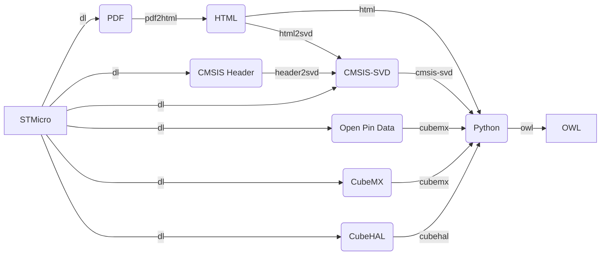

<!--webignore-->
# Semantic Hardware Description
<!--/webignore-->

This project is a collection of data processing pipelines that convert and
combine multiple sources of hardware description data into the most accurate
common representation without manual supervision.

There are many different supported input sources per hardware vendor:

- PDF technical documentation, especially datasheets and reference manuals.
- Source code and CMSIS-SVD files describing peripheral registers.
- Vendor libraries for helping with naming things canonically.
- Proprietary databases extracted from vendor tooling.

These input sources are made accessible via deterministic data pipelines before
finally merging them together. This approach has the best chance of
compensating weaknesses in each individual input source while also arbitrating
conflicts. The output formats are knowledge graphs with a shared ontology.

The resulting knowledge graphs represent a normalized and complete semantic
description of the hardware and are NOT intended to be used directly. Rather,
you should extract the data you require and convert it into a format that is
useful for your specific use case and device scope. This repository only
contains data pipeline code, therefore, if you are interested in the hardware
description data only, please use the resulting knowledge graphs directly.

> **Warning**  
> The project is still in beta and not fully functional or documented.
> Improving the documentation and flexibility of the `modm_data.pdf2html`
> submodule is the main focus of development right now.
> No output data other than HTML is currently supported.


## Installation

You can install this Python ≥3.11 project via PyPi:

```sh
pip install modm-data
```

You also need `g++` and `patch` installed and callable in your path.


## Pipelines

<!--pipelines-->
The data pipelines are implemented as Python submodules inside `modm_data`
folder and have the following structure:


<!--/pipelines-->

Each pipeline has its own command-line interface, please refer to the API
documentation for their advanced usage.

<!--webignore-->
## Development

For development you can install the package locally:

```sh
pip install -e ".[all]"
```

To browse the API documentation locally:

```sh
pdoc --mermaid modm_data
```

<!--inputsources-->
This project uses only publicly available data sources, choosing permissive
licenses whenever possible:

- [STM32 CMSIS header files](https://github.com/modm-io/cmsis-header-stm32): BSD-3-Clause.
- [STM32 Open Pin Data](https://github.com/STMicroelectronics/STM32_open_pin_data): BSD-3-Clause.
- [STM32 CMSIS-SVD files](https://github.com/modm-io/cmsis-svd-stm32): Apache-2.0.
- STMicro CubeMX database: ST SLA.
- STMicro PDF technical documentation: ST SLA.

You can download all input sources via `make input-sources`. Please note that it
may take a while to download ~10GB of data, mostly PDF technical documentation.
<!--/inputsources--><!--/webignore-->

## Citation

This project is a further development of a [peer-reviewed paper published in the
Journal of Systems Research (JSys)](http://dx.doi.org/10.5070/SR33162446).
Please cite this paper when referring to this project:

```bib
@article{HP23,
  author = {Hauser, Niklas and Pennekamp, Jan},
  title = {{Automatically Extracting Hardware Descriptions from PDF Technical Documentation}},
  journal = {Journal of Systems Research},
  year = {2023},
  volume = {3},
  number = {1},
  publisher = {eScholarship Publishing},
  month = {10},
  doi = {10.5070/SR33162446},
  code = {https://github.com/salkinium/pdf-data-extraction-jsys-artifact},
  code2 = {https://github.com/modm-io/modm-data},
  meta = {},
}
```

The paper itself is based on a [master thesis](https://salkinium.com/master.pdf).

<!--links--><!--/links-->
